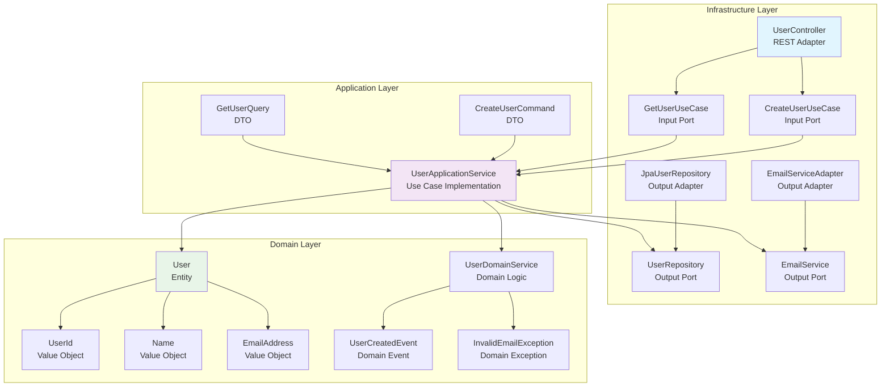

# Hexagonal Architecture Design for Spring Boot Application

## Overview
This design outlines a clean hexagonal architecture for a Spring Boot application with three main layers: Domain, Application, and Infrastructure. The architecture follows SOLID principles, ensures framework independence for the domain, and facilitates easy unit and integration testing.

## Package Structure
```
com.example.hexagonalapp
├── domain
│   ├── model
│   │   ├── entity (User.java)
│   │   ├── valueobject (EmailAddress.java)
│   │   ├── domainevent (UserCreatedEvent.java)
│   │   └── domainexception (InvalidEmailException.java)
│   └── service
├── application
│   ├── service (UserApplicationService.java)
│   ├── port
│   │   ├── in (CreateUserUseCase.java, GetUserUseCase.java)
│   │   └── out (UserRepository.java, EmailService.java)
│   └── dto (CreateUserCommand.java, GetUserQuery.java)
├── infrastructure
│   ├── adapter
│   │   ├── in (UserController.java)
│   │   ├── out (JpaUserRepository.java, EmailServiceAdapter.java, SpringDataUserRepository.java)
│   │   └── config (ApplicationConfig.java)
│   └── persistence
    └── entity (UserEntity.java)
```

## Naming Conventions
- **Domain Layer**:
  - Entities: `EntityName` (e.g., `User`)
  - Value Objects: `ValueObjectName` (e.g., `EmailAddress`)
  - Domain Services: `DomainServiceName` (e.g., `UserValidationService`)
  - Domain Events: `DomainEventName` (e.g., `UserCreatedEvent`)
  - Domain Exceptions: `DomainExceptionName` (e.g., `InvalidUserException`)

- **Application Layer**:
  - Application Services: `ApplicationServiceName` (e.g., `UserApplicationService`)
  - Commands: `CommandName` (e.g., `CreateUserCommand`)
  - Queries: `QueryName` (e.g., `GetUserQuery`)
  - Port Interfaces: `PortName` (e.g., `UserRepository`, `EmailService`)

- **Infrastructure Layer**:
  - Controllers: `ControllerName` (e.g., `UserController`)
  - Repository Implementations: `RepositoryNameImpl` (e.g., `JpaUserRepository`)
  - External Adapters: `AdapterName` (e.g., `EmailServiceAdapter`)
  - Configuration: `ConfigName` (e.g., `JpaConfig`)

## Maven Dependencies
```xml
<dependencies>
    <!-- Spring Boot -->
    <dependency>
        <groupId>org.springframework.boot</groupId>
        <artifactId>spring-boot-starter-web</artifactId>
    </dependency>
    <dependency>
        <groupId>org.springframework.boot</groupId>
        <artifactId>spring-boot-starter-data-jpa</artifactId>
    </dependency>
    <dependency>
        <groupId>org.springframework.boot</groupId>
        <artifactId>spring-boot-starter-validation</artifactId>
    </dependency>

    <!-- Database -->
    <dependency>
        <groupId>com.h2database</groupId>
        <artifactId>h2</artifactId>
        <scope>runtime</scope>
    </dependency>

    <!-- Testing -->
    <dependency>
        <groupId>org.springframework.boot</groupId>
        <artifactId>spring-boot-starter-test</artifactId>
        <scope>test</scope>
    </dependency>
    <dependency>
        <groupId>org.mockito</groupId>
        <artifactId>mockito-core</artifactId>
        <scope>test</scope>
    </dependency>
</dependencies>
```

## Spring Boot Configuration (application.yml)
```yaml
spring:
  application:
    name: hexagonal-app
  datasource:
    url: jdbc:h2:mem:testdb
    driver-class-name: org.h2.Driver
    username: sa
    password:
  jpa:
    hibernate:
      ddl-auto: create-drop
    show-sql: true
  h2:
    console:
      enabled: true

server:
  port: 8080
```

## Example Use Case: Create and Query User
This example demonstrates creating a User entity and querying it across all layers.

### Domain Layer
- **User** (Entity): Represents the user domain object.
- **EmailAddress** (Value Object): Immutable value object for email.
- **UserCreatedEvent** (Domain Event): Event triggered when a user is created.
- **InvalidEmailException** (Domain Exception): Exception for invalid email.

### Application Layer
- **CreateUserCommand**: Command to create a user.
- **GetUserQuery**: Query to retrieve a user.
- **UserApplicationService**: Orchestrates use cases.
- **UserRepository** (Port): Interface for user persistence.
- **EmailService** (Port): Interface for sending emails.

### Infrastructure Layer
- **UserController**: REST controller for user endpoints.
- **JpaUserRepository**: JPA implementation of UserRepository.
- **EmailServiceAdapter**: Adapter for external email service.
- **JpaConfig**: Configuration for JPA.

## Hexagonal Architecture Analysis

### ✅ Clean Implementation Validation

The project implements a **clean hexagonal architecture** with proper separation of concerns:

1. **Domain Layer** (Pure Business Logic):
   - Framework-independent entities, value objects, domain services
   - Business rules and validations encapsulated
   - No external dependencies

2. **Application Layer** (Use Case Orchestration):
   - Input ports (use case interfaces) define contracts
   - Application services orchestrate domain logic
   - Output ports (interfaces) for external dependencies
   - Dependency inversion principle applied

3. **Infrastructure Layer** (Technical Details):
   - Adapters implement application ports
   - Framework-specific implementations (Spring, JPA)
   - Configuration and wiring

### Dependency Flow
- **Infrastructure** depends on **Application** (interfaces)
- **Application** depends on **Domain** (business logic)
- **Domain** has no dependencies (pure)

### SOLID Principles
- ✅ **Single Responsibility**: Each class has one clear purpose
- ✅ **Open/Closed**: Easy to extend with new adapters/entities
- ✅ **Liskov Substitution**: Interfaces allow implementation swapping
- ✅ **Interface Segregation**: Focused port interfaces
- ✅ **Dependency Inversion**: High-level modules don't depend on low-level ones

## Architecture Flow Diagram


## SOLID Principles and Testability
- **Single Responsibility**: Each class has one reason to change.
- **Open/Closed**: Layers are open for extension (e.g., add new adapters) but closed for modification.
- **Liskov Substitution**: Interfaces allow substitution of implementations.
- **Interface Segregation**: Ports define minimal interfaces.
- **Dependency Inversion**: High-level modules depend on abstractions (ports), not concretions.

Unit tests can mock ports, integration tests can use real implementations.

## Extensibility
- Add new entities by following the same structure.
- Introduce new ports for additional external services.
- Implement different adapters (e.g., MongoDB instead of JPA) without changing domain or application layers.